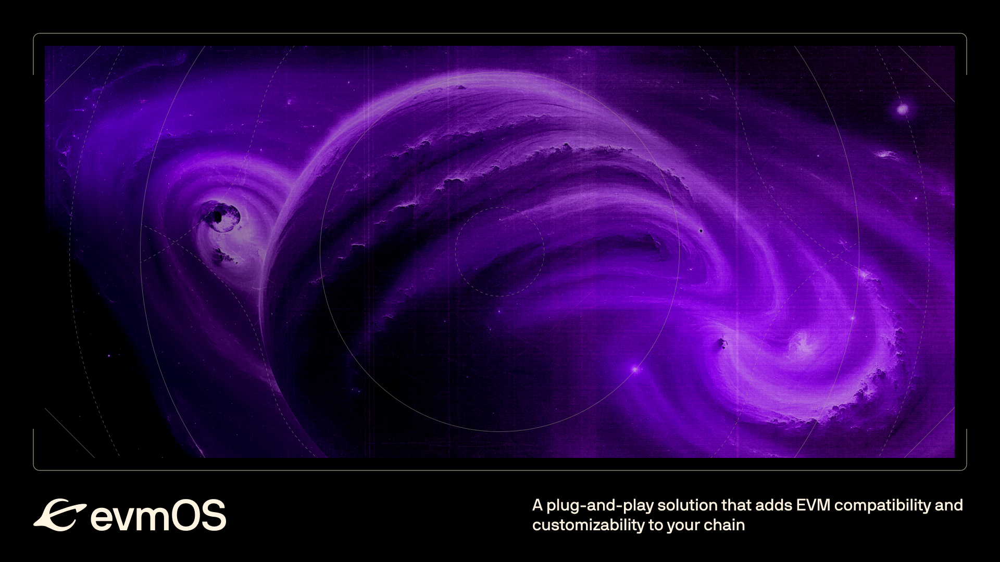

## What is evmOS?

evmOS is a plug-and-play solution that adds EVM compatibility
and customizability to your chain!
Becoming an evmOS partner, you will get:

- Full access to evmOS modules and updates
- Smooth onboarding experience for an existing or new Cosmos chain
- Full access to product partnerships (block explorers, RPCs, indexers etc.)
- Continuous upgrades, access to product and engineering support

evmOS is production ready, and suitable for usage in mission-critical environments such as application-specific EVMs.

## Plug-in evmOS into your chain

### Integration

evmOS can easily be integrated into your existing chain
or added during the development of your upcoming chain launch
by importing evmOS as a go module library.
The evmOS team provides you with integration guides and core protocol support depending on your needs and configurations.
Please check [below](#how-to-become-an-evmos-partner)
how to become an evmOS partner.

### Configurations

Our solution is engineered to provide unique flexibility,
empowering you to tailor every aspect of your Ethereum Virtual Machine (EVM) environment.
Whether you're launching a new blockchain or optimizing an existing one,
evmOS offers a suite of features designed to meet the unique demands of your project.

#### Powerful defaults

evmOS’ modules come out of the box with defaults that will get you up and running instantly.

When integrating all available modules you will get a *permissionless EVM-enabled* blockchain
that *exposes JSON-RPC* endpoints for connectivity with all EVM tooling
like wallets ([MetaMask](https://metamask.io/), [Rabby](https://rabby.io/), and others)
or block explorers ([Blockscout](https://docs.blockscout.com/) and others).
You will have access to *all of evmOS’ EVM extensions*,
which enable access to chain-native functionality
through [Solidity](https://docs.soliditylang.org/en/v0.8.26/) smart contracts.
Your chain provides a *seamless use of any IBC asset in the EVM*
without liquidity fragmentation between wrapped and unwrapped tokens.
Transaction surges are handled by the *self-regulating fee market mechanism* based on EIP-1559
and EIP-712 allows for *structured data signing* for arbitrary messages.

Did we mention? *Everything* can be controlled by on-chain governance
to create alignment between chain teams and their communities.

#### Extensive customizations

Based on these powerful defaults, the feature set is easily and highly customizable:

- *Permissioned/Restricted EVM*

    Maintain control over your network with permissioned or restricted EVM capabilities.
    Implement customized access controls to either blacklist or whitelist individual addresses for calling
    and/or creating smart contracts on the network.
    Read more on [EVM access control here](https://docs.evmos.org/protocol/modules/evm#access-control).

- *EVM Extensions*

    Extend the capabilities of your EVM!
    These [EVM extensions](https://docs.evmos.org/develop/smart-contracts/evm-extensions) allow functionality
    that is native to Cosmos SDK modules to be accessible from Solidity smart contracts.
    We provide a selection of plug-and-play EVM extensions that are ready to be used *today*.

    Push the boundaries of what’s possible with fully custom EVM extensions.
    Develop the  business logic that sets your chain apart from others with the mature tooling for the Go language
    and offer its functionality to the masses of Solidity smart contract developers
    to integrate in their dApps.

- *Single Token Representation v2 & ERC-20 Module*

    Simplify token management with [Single Token Representation v2](https://medium.com/evmos/evmos-introduces-native-tokens-as-erc-20-for-cosmos-1a4c7de5c3e9)
    and our `x/erc20` module to elevate the user experience on your chain.
    Align IBC coins and ERC-20s and say goodbye to fragmented liquidity.
    One balance. In every tool.

- *EIP-1559 Fee Market Mechanism*

    Take control of transaction costs with our
    ready-to-use [EIP-1559 fee market](https://eips.ethereum.org/EIPS/eip-1559) solution.
    Tailor fee structures to suit your network’s specific needs,
    balancing user affordability with network sustainability.
    Or disable it altogether.

- *JSON-RPC Server*

    There is full control over the exposed namespaces and fine-grained control of the
    [JSON-RPC server](https://docs.evmos.org/develop/api/ethereum-json-rpc).
    Adjust the configuration to your liking,
    including custom timeouts for EVM calls or HTTP requests,
    maximum block gas, the number of maximum open connections, and more.

- *EIP-712 Signing*

    You have the option to integrate our [EIP-712 signature](https://eips.ethereum.org/EIPS/eip-712) implementation,
    which allows Cosmos SDK messages to be signed with EVM wallets like MetaMask.

- *Custom Improvement Proposals (Opcodes)*

    Any evmOS partner is given the opportunity to customize bits of their EVM opcodes and add new ones.
    Read more on [custom operations here](https://docs.evmos.org/develop/smart-contracts/custom-improvement-proposals).

### Forward-compatibility with Ethereum

Ethereum-equivalence describes any EVM solution,
that is identical in transaction execution to the Ethereum client.
It does not more, but also not less than that.  
Ethereum-compatible means,
that the EVM can be set up to run every transaction
that is valid on Ethereum while the handling of the transactions
can diverge in e.g. result or cost.

We like to coin the term **forward-compatible**
as a description of our EVM solution,
meaning that any evmOS chain can run any valid smart contract
from Ethereum but is able to implement new features that are
not (yet) available on the standard Ethereum VM,
thus moving the standard forward.

## Roadmap

Our near-term roadmap looks like this:

**2024 Q3 - v1**

- Cosmos SDK v0.50 support

**2024 Q4 - v2**

- Proof of Authority
- ADR-008
- Support for modular Blockchains - integrate with Rollchain

Of course we are always open to collaborate with our partners
in case of mutual interests for other features.

## How to become an evmOS Partner?

evmOS operates under a Non-Commercial License,
ensuring our partnerships are focused on building successful
business cases that contribute to the long-term success of both evmOS
and your project.
Our team, consisting of the creators of Ethermint and
seasoned experts in Cosmos and EVM,
is ready to assist with technical onboarding, support,
and go-to-market strategies.

If you're interested in integrating evmOS into your stack
and exploring a partnership, please reach out
to discuss your product and technical requirements.
We look forward to collaborating with you on this journey.

Contact us at [https://evmos.org/contact-us](https://evmos.org/contact-us/)
